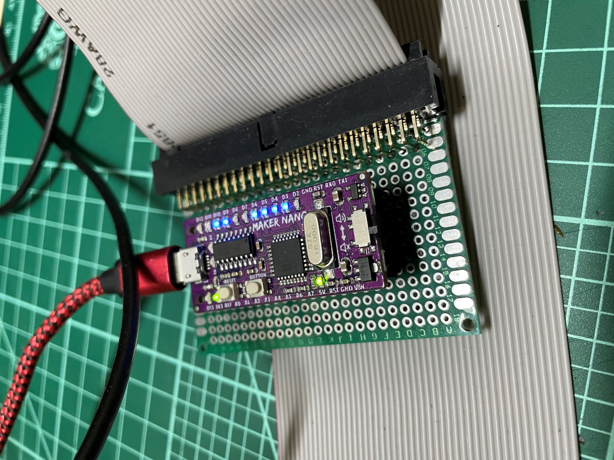
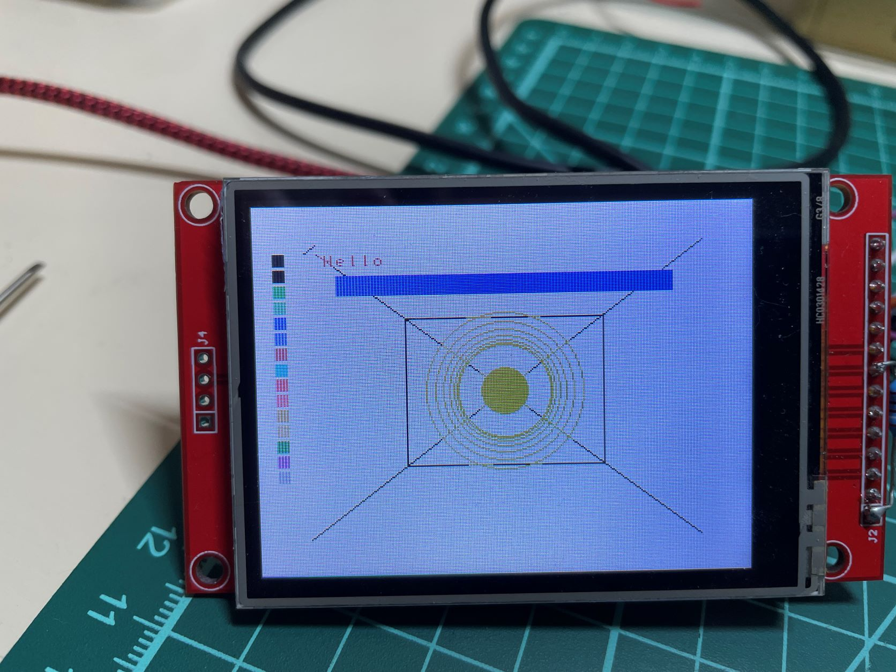
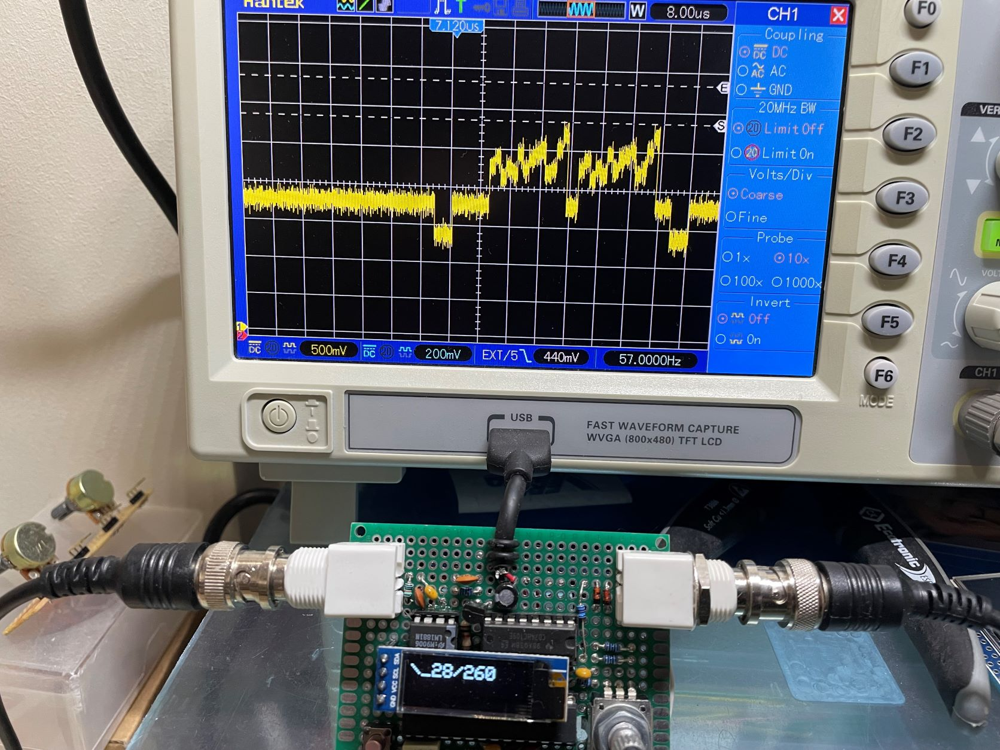

# VDPtoTFT
Converts the output from an old TMS9928A Video Display Processor to drive a small TFT panel using either an SPI or a parallel interface. For lovers of microcomputers from the 70s and 80s.

# Introduction
Once upon a time, when I were a lad, I had my very own Z80 based computer (Nascom 2) which I had built from a kit and then extended with cards of my own design. I always wanted a colour graphics card, and was most envious of computers which used the Texas Instruments TMS9918 family of chips. I never did get a graphics card, though I did build a two-channel DtoA converter and used that to drive my oscilloscope.

So, wind forward to todayish and I'm in the middle of a project to build a drum machine, when I discover a simple computer I'd cobbled together on a breadboard and which was now living in a box in the shed. Putting two and two together, I decided to see whether it would have been possible to build the drum machine using 70s technology. First thing to do was to decide on what would take the place of the TFT display. You can see where this is going, and how very deep that rabbit-hole is.

Right.

So, for anyone with an old computer using one of the TMS9928/29/128/129 chips, here is a project which will allow you to use it to drive a small, cheap TFT display. It won't work with the TMS9918 chips because it needs to sample the Y and R-Y outputs which don't exist on the TMS9918.

All it needs is an STM32G4 microcontroller. I used a Nucleo-G474RE board because I had one already.

# But Does It Work?
Yes, it does. I confess to being suprised that I was able to make it work. There is a little bit of flicker in a couple of the colours, due to noise in the sampling process, so I have a couple of improvements I'll be working on. 
- Tweak the on-board VREF to output a lower voltage (2.8V instead of 3.25) thus potentially increasing the ADC accuracy.
- Build a custom PCB

I may end up making a custom PCB including the TMS chip so there's an all-in-one solution for RC2014 folks. Let me know if you would like this.

# Pictures

 - see my other project [VideoTrigger](https://github.com/ukmaker/VideoTrigger) for details
