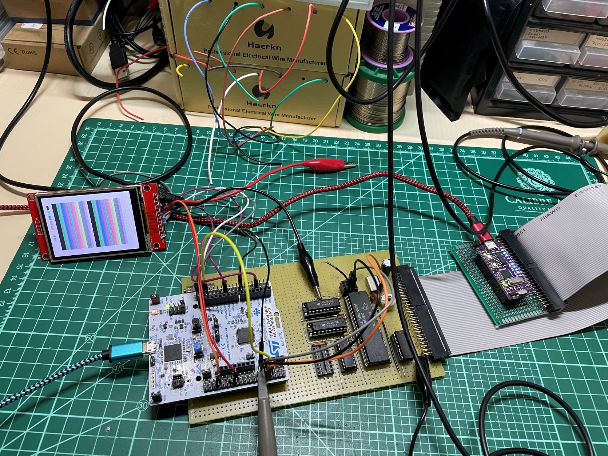
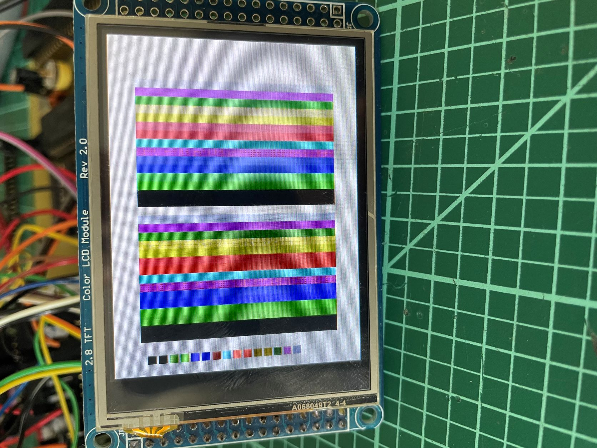
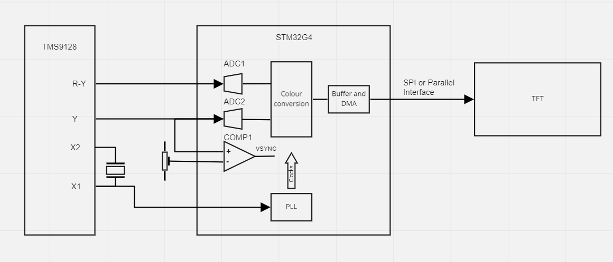
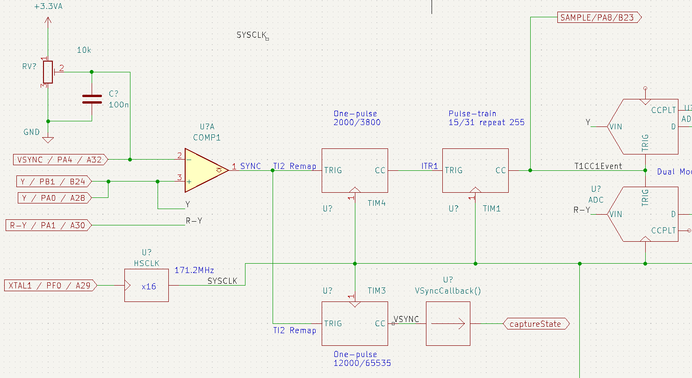
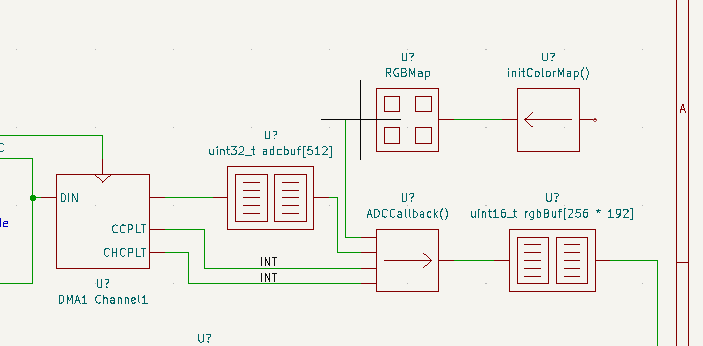
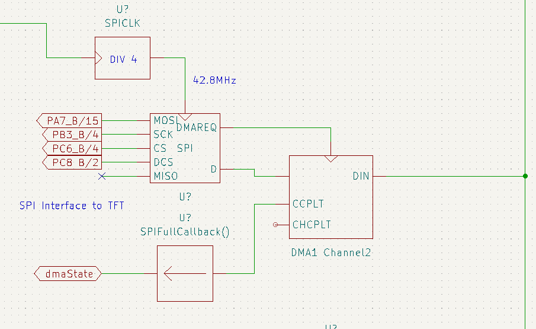
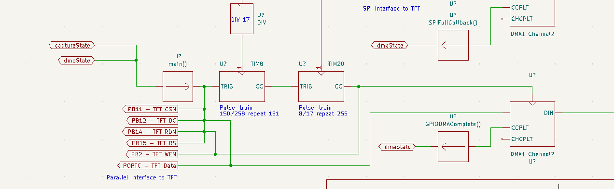

# VDPtoTFT
Converts the output from an old TMS9928A Video Display Processor to drive a small TFT panel using either an SPI or a parallel interface. For lovers of microcomputers from the 70s and 80s.

# Introduction
Once upon a time, when I were a lad, I had my very own Z80 based computer (Nascom 2) which I had built from a kit and then extended with cards of my own design. I always wanted a colour graphics card, and was most envious of computers which used the Texas Instruments TMS9918 family of chips. I never did get a graphics card, though I did build a two-channel DtoA converter and used that to drive my oscilloscope.

So, wind forward to todayish and I'm in the middle of a project to build a drum machine, when I discover a simple computer I'd cobbled together on a breadboard and which was now living in a box in the shed. Putting two and two together, I decided to see whether it would have been possible to build the drum machine using 70s technology. First thing to do was to decide on what would take the place of the TFT display. You can see where this is going, and how very deep that rabbit-hole is.

Right.

So, for anyone with an old computer using one of the TMS9928/29/128/129 chips, here is a project which will allow you to use it to drive a small, cheap TFT display. It won't work with the TMS9918 chips because it needs to sample the Y and R-Y outputs which don't exist on the TMS9918.

All it needs is an STM32G4 microcontroller. I used a Nucleo-G474RE board because I had one already.

# But Does It Work?
Yes, it does. I confess to being suprised that I was able to make it work. There is a little bit of flicker in a couple of the colours, due to noise in the sampling process, so I have a couple of improvements I'll be working on. 
- Tweak the on-board VREF to output a lower voltage (2.8V instead of 3.25) thus potentially increasing the ADC accuracy.
- Build a custom PCB

I may end up making a custom PCB including the TMS chip so there's an all-in-one solution for RC2014 folks. Let me know if you would like this.

# Pictures

My VDP board with the Nucleo bolted to the side

Yes, I'm cheating. Driving the VDP from an Arduino for now

Close up of an image on the SPI display

And a test-pattern on the parallel display

Here's a bit of test-gear I built to help. 
 - see my other project [VideoTrigger](https://github.com/ukmaker/VideoTrigger) for details

# Theory Of Operation

The following block diagram shows the essentials of how this works.

The output of the VDP's crystal oscillator is used to drive the clock input on the STM32G4. The STM32G4's PLL multiplies the VDP's 10.7MHz clock up by a factor of 16 to 171.2 MHz (thus ever so slightly overclocking the STM32, which is rated to 170MHz). This ensures that all processing happens synchronously to the signals being generated by the VDP. 

The VDP is capable of producing 16 different colours, and the generated signal comes from three outputs - Y, R-Y and B-Y. It turns out that sampling only Y and R-Y give us enough information to deduce the colour being generated, which is good as it reduces the amount of processing needed. These signals are fed to the STM's ADC1 and ADC2 which are operated in "dual-mode". This means that both inputs are sampled synchronously under the control of ADC1. The samples are place in a small circular buffer using DMA.

The ADCs are triggered by a timer which is in turn triggered by a comparator which samples the Y signal to determine when horizontal and vertical sync events happen (when the Y signal level drops below the black value). A trimpot is used to set this level correctly. Once a sync event is detected a chain of two timers is used to generate the sampling signals for the ADCs. The first timer (TIM4) starts the second timer (TIM1) after a delay calculated such that TIM1's first output pulse will happen just as the first pixel data is output by the VDP. This delay is approx 12 microseconds from the horizontal sync pulse.

The ADC's DMA channel is set to run in circular mode, with a buffer size of 512 half-words. The DMA unit will raise a transfer-half-complete interrupt after 256 transfers, which corresponds to one complete line of pixels. There are now approx 16us available for processing before the start of the next line. The interrupt service routine (ADCCallback()) uses this time to read the data from the buffer, map it from read values (samples are 6 bits per channel) to 16-bit RGB values and store them in the dma buffer, which holds an entire frame of samples. This repeats on the transfer-complete interrupt and so on until and entire frame has been sampled and mapped. 

If the sync signal stays low for more than one line-time (64 us), TIM3 will detect this as a vertical sync, and raise an interrupt. This is used by the state-machine running in the main() loop to initiate the DMA transfer from the RGB buffer to either the SPI unit or GPIO Port C if a parallel TFT is being used.

If SPI is being used, the transfer happens in 4 blocks because the maximum size for a single DMA transfer is 65536 transfers. One full frame holds 256 pixels * 192 lines * 2 bytes of data = 98,304 transfers (SPI config for my screen is in bytes). I.e. too many transfers for a single DMA session. The SPI interface is clocked at 42.8MHz, even though the datasheet for the chip used in my display (ILI9341) says the maximum SPI clock speed is 10MHz! Even so, there just is not enough time in one frame to sample and transfer all the data so instead the state machine runs a sample for a frame and then takes a frame to refresh the screen. This is visible as 30Hz flicker on the screen. I have ordered a TMS9129 to use in place of the TMS9128. The TMS9129 is the European version which has a 50Hz refresh rate rather than the 60Hz of the TMS9128. With this lower frame rate I think I'll be able to refresh the screen over SPI at a full 50Hz, thus eliminating the flicker.

If a parallel interface is being used the DMA controller can transfer the entire 49K RGB buffer in one go at 60Hz, so there is no flicker. The parallel interface runs at 10MHz.

# Building
This is a project built using the STM32CubeIDE and the STM32 HAL. If this offends you, feel free to fork my repo and rewrite it in whatever manner you choose.

For now, there is little to do to build this other than

- Install STM32CubeIDE if you haven't already got it
- Download this repo
- Open the project in the IDE and build it
- Connect the Nucleo to the display of your choice (see below)
- Connect the Nucleo to your VDP
- Plug everything in 
- Click Run in the IDE

## Connecting Your Display
